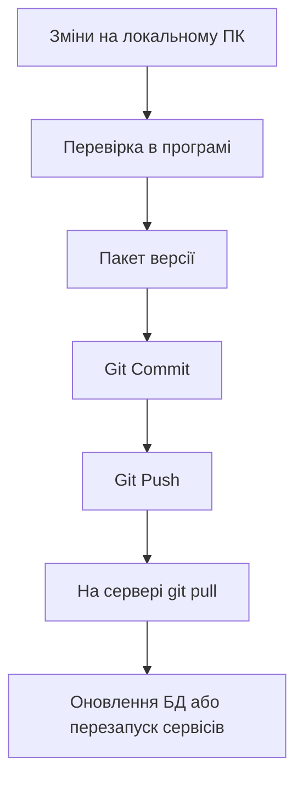
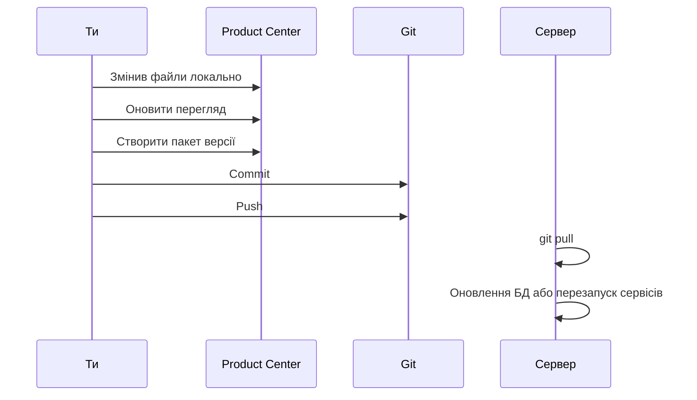

# Порядок оновлення продукту

Цей документ пояснює, як правильно оновлювати продукт, коли ти:

- змінив код;
- змінив файли бази;
- хочеш зібрати пакет версії;
- хочеш відправити все на GitHub і потім оновити сервер.

## Головна ідея

## Що таке пакет версії

Пакет версії - це набір файлів, які ти хочеш передати далі як оновлення.

У пакеті зберігається:

- номер версії;
- дата створення;
- гілка Git;
- короткий коміт;
- список файлів;
- план дій для сервера.

## Як працювати правильно

### 1. Спочатку змінюєш файли локально

Наприклад:

- код;
- SQL або SQLite-дані;
- шаблони;
- службові скрипти;
- тексти;
- картинки або ресурси.

### 2. Перевіряєш, що все працює

Не відправляй зміни, поки не переконаєшся, що на твоєму ПК все нормально.

### 3. Відкриваєш вкладку `Версії`

Там програма покаже:

- скільки файлів вже було упаковано;
- скільки зараз нових змін;
- скільки готово до наступного пакета.

### 4. Натискаєш `Оновити перегляд`

Після цього програма ще раз читає поточний стан і оновлює список.

### 5. Натискаєш `Створити пакет версії`

Програма створює новий пакет, наприклад:

- `update_0001`
- `update_0002`
- `update_0003`

### 6. Відкриваєш вкладку `Git`

Тут видно, що реально змінено у репозиторії.

### 7. Робиш `Commit`

Це фіксація цього стану в історії Git.

### 8. Робиш `Push`

Це відправка змін на GitHub.

### 9. На сервері робиш `git pull`

Сервер забирає новий код.

### 10. Якщо зміни в БД, запускаєш безпечне оновлення

Після `git pull` запускаєш оновлення БД або службові скрипти.

## Різні типи змін

### Якщо змінив код

1. Перевір локально.
2. Створи пакет версії.
3. Зроби `Commit`.
4. Зроби `Push`.
5. На сервері виконай `git pull`.
6. Перезапусти потрібні сервіси.

### Якщо змінив базу даних

1. Перевір локально.
2. Створи пакет версії.
3. Зроби `Commit`.
4. Зроби `Push`.
5. На сервері виконай `git pull`.
6. Запусти безпечне оновлення БД.
7. Перевір, чи дані не зламались.

### Якщо змінив і код, і БД

1. Перевір локально все разом.
2. Створи пакет версії.
3. Зроби `Commit`.
4. Зроби `Push`.
5. На сервері виконай `git pull`.
6. Спочатку БД, потім сервіси.

## Чого не робити

- Не роби `Commit` раніше, ніж сам розумієш, що готове піти в реліз.
- Не змішуй у пакет службові файли пакета версії.
- Не оновлюй сервер до локальної перевірки.
- Не змінюй серверну БД напряму без backup.

## Рекомендований робочий порядок

## Просте правило для запам'ятовування

**Спочатку перевірив, потім зібрав пакет, потім закомітив, потім відправив на GitHub, і тільки після цього оновлюєш сервер.**

## Якщо є сумнів

Якщо не впевнений, що саме робити:

1. Відкрий вкладку `Git`.
2. Подивись список файлів.
3. Відкрий вкладку `Версії`.
4. Онови перегляд.
5. Якщо не зрозуміло, зупинись і перевір ще раз локально.

## Як це виглядає в програмі

- `Git` - що змінено зараз.
- `Версії` - що піде в пакет оновлення.
- `Продукт` - запуск і контроль сервісів.
- `База` - налаштування шляхів до бази та оновлення БД.

