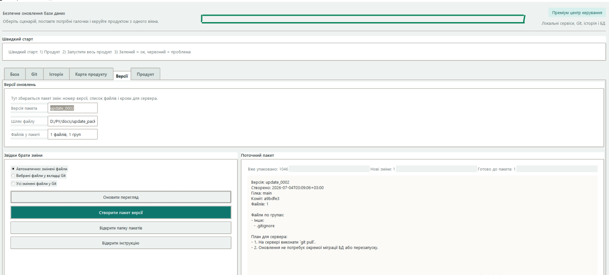
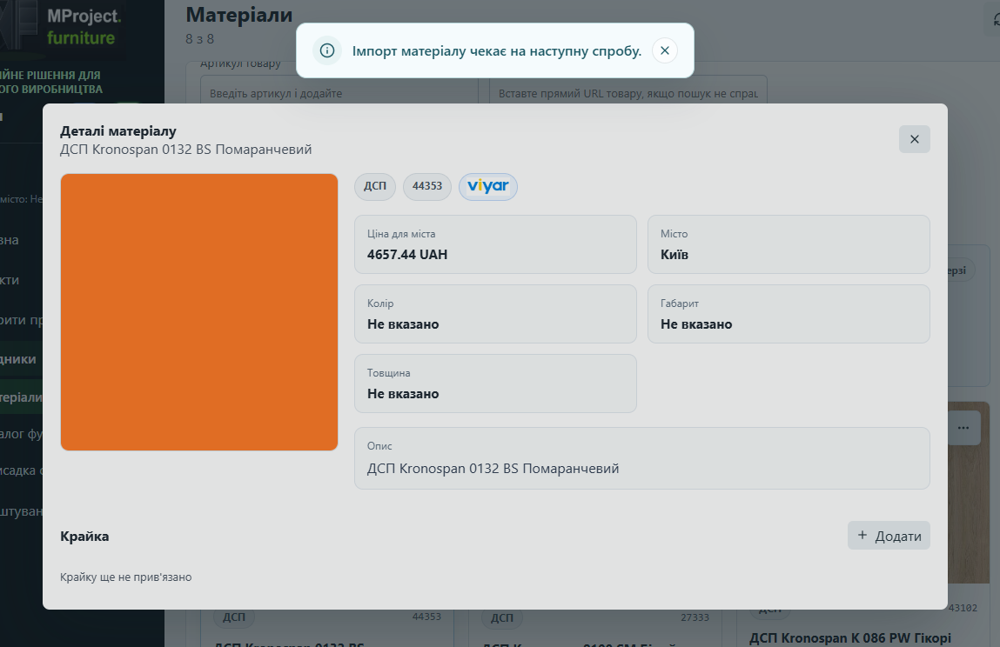
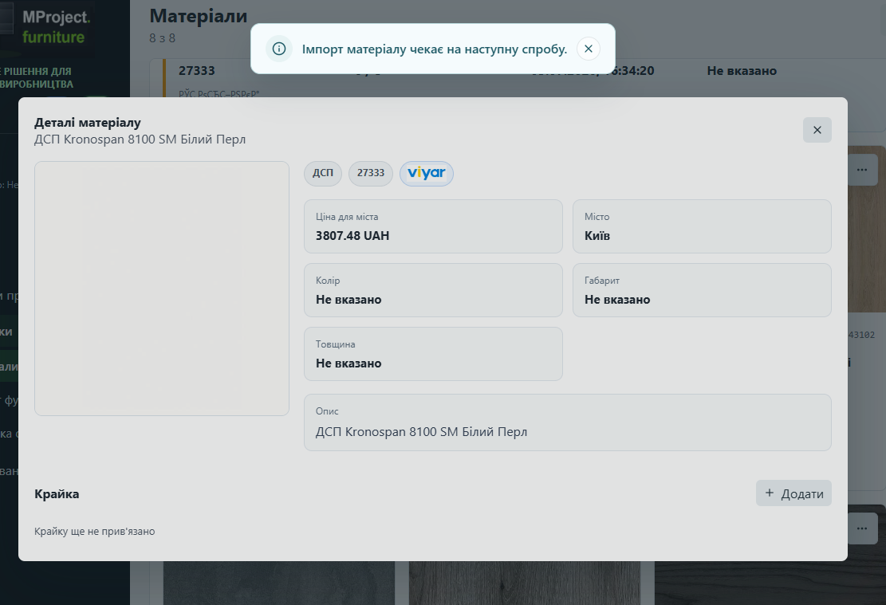
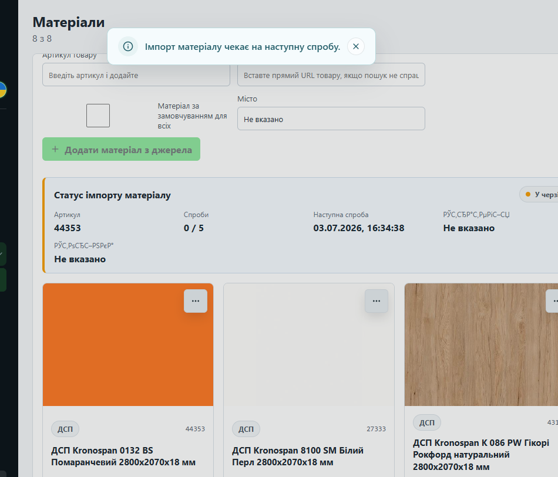

# Довідка по роботі з центром керування

Це коротка пам'ятка, щоб не губитися між кодом, пакетами версій, Git і базою даних.

## Як працювати

1. Зміни код або дані локально.
2. Відкрий програму-центр керування.
3. Перевір локальний результат у вкладках `Продукт` або `База`.
4. Перейди у вкладку `Версії`.
5. Натисни `Оновити перегляд`.
6. Якщо у списку видно лише нові зміни, натисни `Створити пакет версії`.
7. Після цього зроби `commit` лише тих файлів, які реально змінилися.
8. Якщо треба, зроби `push` на GitHub.
9. На сервері застосуй нову версію пакета або зміни БД.

## Що важливо

- Якщо файл не редагувався, він не має знову потрапляти в пакет версії.
- Якщо змінювалися тільки дані в базі, краще оформлювати це окремим кроком.
- Якщо одночасно змінилися код і база, зручніше розділити це на два зрозумілі пакети.

## Що дивитися в програмі

- `Версії` - показує пакет змін і список нових файлів.
- `Git` - показує, які файли змінені та готові до коміту.
- `База` - допомагає перевірити локальні БД і запускати підготовчі дії.
- `Довідка` - короткий візуальний сценарій з прикладами.

## Скріншоти

## Якщо щось не так

- Якщо пакет версії містить зайві файли, натисни `Оновити перегляд` ще раз і перевір джерело змін.
- Якщо текст відображається дивно, відкрий `Довідка` і порівняй зі скріном.
- Якщо програма не стартує, перевір лог запуску у вкладці `Продукт`.
