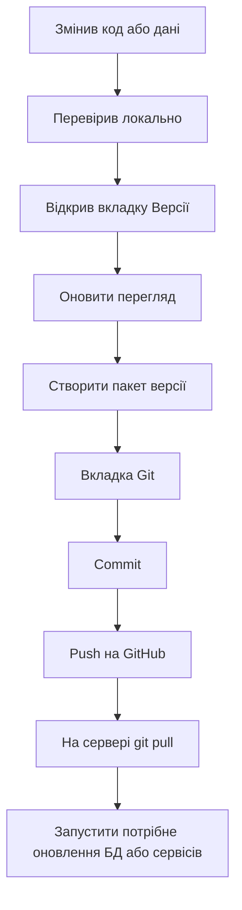

# Проста інструкція для Product Center

Це коротка інструкція, щоб швидко зрозуміти, як працювати з програмою щодня.

## Для чого ця програма

Product Center допомагає:

- запускати локальні частини продукту;
- дивитися, що зараз працює;
- бачити зміни в Git;
- збирати пакет версії;
- підготовлювати оновлення для GitHub і сервера;
- працювати з базою даних без ручного хаосу.

## Найпростіший порядок дій

## Що означає кожен крок

1. **Змінив код або дані**
   - Ти щось поправив у файлах або в базі.
   - Після цього не поспішай одразу відправляти зміни.

2. **Перевірив локально**
   - Запусти програму.
   - Подивись, чи все працює на своєму комп’ютері.

3. **Відкрив вкладку `Версії`**
   - Тут програма збирає пакет оновлень.
   - Вона показує, що вже упаковано, що нове і що готове до наступного пакета.

4. **Натиснув `Оновити перегляд`**
   - Програма ще раз дивиться на зміни.
   - Якщо є нові зміни, вони з’являться в списку.

5. **Натиснув `Створити пакет версії`**
   - Програма збере файл `update_000X`.
   - Це і є пакет, який потім можна використовувати для оновлення.

6. **Відкрив вкладку `Git`**
   - Подивись, які файли ще лишилися зміненими.
   - Тут ти бачиш, що реально потрібно закомітити.

7. **Зробив `Commit`**
   - Фіксуєш цей стан у Git.
   - Це як зберегти контрольну точку.

8. **Зробив `Push`**
   - Відправляєш коміт на GitHub.
   - Після цього віддалений репозиторій уже має цей стан.

9. **На сервері `git pull`**
   - Сервер забирає нові зміни з GitHub.

10. **Запускаєш потрібні оновлення**
   - Якщо зміни стосуються БД, запускаєш безпечне оновлення БД.
   - Якщо зміни в коді, перезапускаєш сервіси.

## Що робити, якщо зміни тільки у файлах

Якщо ти змінив код, але не чіпав базу:

1. Перевір локально.
2. Відкрий `Версії`.
3. Натисни `Оновити перегляд`.
4. Якщо все добре, натисни `Створити пакет версії`.
5. Потім зайди в `Git`.
6. Зроби `Commit`.
7. Зроби `Push`.

## Що робити, якщо зміни в базі даних

Якщо ти міняв дані в БД:

1. Спочатку перевір це локально.
2. Подивись, чи не зламався продукт.
3. Відкрий `Версії` і згенеруй пакет.
4. У `Git` закоміть зміни.
5. Відправ `Push`.
6. На сервері спочатку `git pull`.
7. Потім запускати безпечне оновлення БД.
8. Після цього ще раз перевір результат.

## Як не заплутатись

- **Пакет версії** потрібен для оновлення.
- **Commit** потрібен для Git.
- **Push** потрібен для GitHub.
- **Оновлення БД** потрібно тільки тоді, коли реально міняли дані або структуру.

## Що натискати в програмі

- Вкладка `Git`:
  - дивись список змінених файлів;
  - готуй файли до коміту;
  - роби `Commit` і `Push`.

- Вкладка `Версії`:
  - дивись, що вже упаковано;
  - натискай `Оновити перегляд`;
  - натискай `Створити пакет версії`.

- Вкладка `Продукт`:
  - запускай локальні сервіси;
  - дивись статуси;
  - відкривай додаткові частини продукту.

## Короткий чекліст перед відправкою

- [ ] Перевірив локально.
- [ ] Подивився `Версії`.
- [ ] Створив пакет.
- [ ] Подивився `Git`.
- [ ] Зробив `Commit`.
- [ ] Зробив `Push`.
- [ ] На сервері виконано `git pull`.
- [ ] Якщо треба, оновив БД.

